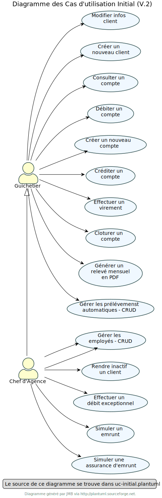

= Documentation Technique - DailyBankApp
:toc:
:toclevels: 3
:toc-position: preamble
:toc-title: Sommaire
:sectnums:

[cols="1,1", options="header"]
|===
| Version | Date

| V2 | 28 mai 2023 
|===

[discrete]
=== Equipe : 1A1

[discrete]
=== Membres :
[cols="1,1,1", options="header"]
|===

|Mathéo KATBIE | Bilon KWADJANI |Illan GABARRA

|===

== Présentation de l'Application

=== Contexte

Le contexte général actuel est marqué par une forte transformation numérique des services bancaires. Les banques françaises ont investi massivement dans le digital pour répondre aux exigences d'instantanéité de leurs clients et ont créé des offres alternatives, telles que les banques mobiles, tout en modernisant en profondeur leurs services de banque au quotidien.

Ces investissements majeurs ont été accompagnés de restructurations et d'une refonte des réseaux de banque de détail. Les banques ont robotisé les tâches automatisables et modernisé les outils de bureautique des guichetiers pour offrir des services bancaires rapides et efficaces.

Cette transformation numérique a également conduit à une révolution organisationnelle au sein des banques, qui évoluent vers une approche transversale et pluridisciplinaire pour suivre le client sans interruption et en temps réel. Des professionnels de diverses disciplines interagissent pour développer les parcours et les trajectoires de chaque client.

Dans ce contexte, la banque DailyBank souhaite développer une application JAVA-Oracle de gestion des comptes clients pour remplacer plusieurs outils obsolètes. Cette application sera déployée dans les 100 agences que compte son réseau et permettra de gérer des comptes bancaires de dépôt pour des clients préalablement créés, de débiter ou créditer un compte soit par virement, soit par une personne physique se présentant devant un guichet. Ce développement s'inscrit dans le cadre de la restructuration des services bancaires de la banque DailyBank.

[[use-case-general]]
=== Use case de l'application
L'application de DailyBank est conçue pour être utilisée par différents acteurs au sein de la banque, ayant chacun des rôles spécifiques et des droits différents. Voici les utilisateurs du logiciel et les actions qui peuvent réaliser :

Tous ces cas d'utilisation sont possible si l'utilisateur s'est authentifié avec son login et son mot de passe. 

==== Guichetier

Le guichetier est le premier niveau de droit d'accès, il peut lire toutes les informations sur les client (Comptes, opérations, informations personneles), faire toutes les opérations de base sur des clients de son agence, créer de nouveaux clients et de nouveaux comptes, cloturer des comptes et les réouvrir. 

===== Version 0

- *Modifier les informations des clients* : le guichetier peut accéder aux informations des clients existants et les modifier si nécessaire, par exemple, en mettant à jour leurs numéros de téléphone ou leurs adresses.

- *Inscrire un nouveau client* : le guichetier peut enregistrer les informations personnelles d'un nouveau client dans le système, comme son nom, son adresse, son numéro de téléphone.

- *Consulter un compte* : le guichetier peut accéder aux informations des comptes d'un client existant, comme le solde actuel et les transactions récentes.

- *Débiter un compte* : le guichetier peut effectuer des opérations de débit sur le compte d'un client, par exemple, en retirant de l'argent liquide ou en effectuant un paiement. Pour cela le montant débité doit être supérieur à 0 et le solde après débit ne dois pas être inférieur au découvert autorisé et le compte client à qui appartient le compte ne doit pas être désactivé.

===== Version 1

- *Créditer un compte* (Java et BD avec procédure stockée) : Le guichetier peut effectuer des opérations de crédit sur le compte d'un client. Pour cela le montant crédité doit être supérieur à 0 et le compte client à qui appartient le compte ne doit pas être désactivé.

- *Créer un compte* : Le guichetier peut créer un nouveau compte pour un client existant en générant un nouveau numéro de compte unique. Pour cela le compte du client ne doit pas être désactivé.

- *Effectuer un virement de compte à compte* : Le guichetier peut transférer de l'argent d'un compte à un autre en utilisant le numéro de compte du destinataire et le montant à transférer. Les comptes doivent appartenir à des clients de la DailyBank. Le montant transféré devra être supérieur à 0. Le solde après transfert du compte source ne dois pas être inférieur au découvert autorisé et les comptes clients à qui appartiennent les comptes ne doivent pas être désactivés et les comptes non clôturés.

- *Clôturer un compte* : Le guichetier peut clôturer le compte bancaire d'un client si nécessaire, le compte doit avoir un solde de 0.

===== Version 2

- *Générer un relevé PDF* : Le peut générer le relevé bancaire d'un compte pour une période qu'il saisit, composé de la listes des opérations du comptes et de plusieurs informations tels que la somme des crédits durant la période, il permettra au guichetier de donner au client un relevé lui permettant de prendre au mieux des décisions lié à son argent.

- *Gérer (faire le "CRUD") les prélevement automatiques*: le guichetier peut créer, lire, modifier, supprimer des prélevements automatiques définit par un montant, un jour de prélévement et un bénéficiaire

==== Chef d'Agence

Le chef d'agence est le deuxième niveau de droit d'accès et l'utilisateur avec le plus de droits. 
Il peut faire toutes les actions d'un guichetier mais en plus de cela il peut gérer tous les employés de son agence.

===== Version 0

- *Rendre inactif un client* : le chef d'agence peut désactiver le compte d'un client existant si nécessaire. Cela doit empêcher de faire des opérations sur son/ses compte(s).

===== Version 1

- *Gérer (faire le "CRUD") les employés*: le chef d'agence peut créer, lire, mettre à jour et supprimer les informations des employés de son agence. 

===== Version 2

- *Réaliser un débit exceptionnel* : Le chef d'agence peut faire un débit exceptionnel pour un compte courant, c'est à dire qu'il peut faire un débit faisant que le solde devient inférieur au découvert maximum autorisé par le compte. Une alerte le prévient lorsqu'il essaye d'en faire un pour lui demander de confirmer.

- *Simuler un emprunt* : le chef d'agence peut simuler un emprunt pour un montant, un taux d'intérêts fixe et un nombre de période donné. Cela lui permettra de générer un tableau d'emprunt (affiché dans l'interface) lui permettant de montrer plusieurs informations sur l'emprunt au client tel que : Le capital restant dû en début et fin de période, le montant des intérêts, du principal et de la mensualité/annuité pour chaque période

- *Simuler une assurance d'emprunt* : le chef d'agence peut simuler une assurance d'emprunt définit par le montant emprunté, un taux d'intérêts fixe et un nombre de période donné. Cela doit lui permettre de donner au client des informations sur l'assurance tel que le coût total de l'emprunt, le coût des mensualités/annuités de l'assurance.

== Diagramme de classe des données global

.Diagramme de Classe
image::../../ressources/images/dc-initialv2.svg[]

Ce diagramme de classe des données représente la structure des classes et des relations entre elles dans le code développé. Voici une description détaillée des éléments particuliers présents dans le diagramme de classe :

=== Description

* Classe "Employe" :
** Attributs : nom, prénom, droitAcces, login, motPasse.
Cette classe représente un employé de l'agence bancaire. Chaque employé a un nom, un prénom, des droits d'accès, un login et un mot de passe.

* Classe "AgenceBancaire" :
** Attributs : nomAg, adressePostaleAg.
Cette classe représente une agence bancaire. Chaque agence a un nom et une adresse postale.

* Classe "Client" :
** Attributs : nom, prénom, adressePostale, email, téléphone, estInactif.
Cette classe représente un client de l'agence bancaire. Chaque client a un nom, un prénom, une adresse postale, une adresse e-mail, un numéro de téléphone et un statut d'activité (actif ou inactif).

* Classe "CompteCourant" :
** Attributs : idNumCompte, debitAutorise, solde, estCloturé.
Cette classe représente un compte courant. Chaque compte courant a un identifiant de compte, un montant de débit autorisé, un solde et un indicateur de clôture.

* Classe "Operation" :
** Attributs : montant, dateOp, dateValeur.
Cette classe représente une opération effectuée sur un compte. Chaque opération a un montant, une date d'opération et une date de valeur.

* Classe "TypeOperation" :
** Cette classe n'a pas d'attributs définis dans le diagramme.
** Relation "ChefAgence" entre "Employe" et "AgenceBancaire":
Le lien indique que l'employé peut être le chef de l'agence bancaire.
La cardinalité est de 0 à 1, ce qui signifie qu'une agence bancaire peut avoir au plus un chef.

=== Cardinalité

* Employe - AgenceBancaire :
** Cardinalité : 0..1 à 1
** Signification : Un employé peut être associé à zéro ou une seule agence bancaire, tandis qu'une agence bancaire doit avoir exactement un employé chef.

* Employe - Client :
** Cardinalité : 1 à *
** Signification : Un employé peut être associé à un ou plusieurs clients, mais un client doit avoir au moins un employé associé.

* AgenceBancaire - Client :
** Cardinalité : 0 à *
** Signification : Une agence bancaire peut avoir zéro ou plusieurs clients, mais un client doit être associé à une agence bancaire.

* Client - CompteCourant :
** Cardinalité : 0 à *
** Signification : Un client peut avoir zéro ou plusieurs comptes courants, mais un compte courant doit être associé à un client.

* CompteCourant - Operation :
** Cardinalité : 0 à *
** Signification : Un compte courant peut avoir zéro ou plusieurs opérations, mais une opération doit être associée à un compte courant.

* TypeOperation - Operation :
** Cardinalité : 1 à *
** Signification : Un type d'opération peut être associé à une ou plusieurs opérations, tandis qu'une opération doit être associée à un type d'opération.

Ces cardinalités indiquent les relations et les contraintes entre les différentes classes du système. Elles définissent combien d'instances d'une classe peuvent être liées à une ou plusieurs instances d'une autre classe.

== Architecture

=== Générale

Pour plus de détail sur l'architecture général en termes de sous-systèmes pour l'application de gestion des comptes clients de la banque DailyBank, voici les éléments détaillés qui la compose :

* *Poste guichetier* :
Le poste guichetier représente le terminal utilisé par le personnel en guichet pour interagir avec l'application de gestion des comptes clients. Il permet aux guichetiers d'effectuer des opérations bancaires telles que les dépôts, les crédits et les transferts d'argent pour les clients en personne.

* *Poste chef d'agence* :
Le poste chef d'agence représente le terminal utilisé par le chef d'agence pour interagir avec l'application.Il permet aux chef d'agence d'effectuer des opérations bancaires et de gérer les employés de son agence

* *Base de données* :
La base de données stocke toutes les informations relatives aux comptes clients, telles que les données de profil, les transactions, les soldes, etc. Elle fournit un accès persistant et sécurisé aux données nécessaires pour le fonctionnement de l'application. Dans ce cas, l'application utilise Oracle comme système de gestion de base de données pour stocker et gérer les données des comptes clients.

* *Réseau bancaire* :
Le réseau bancaire est utilisé pour les opérations de virement entre comptes domiciliés dans le réseau. Il relie les différentes agences de la banque et permet les transferts d'argent entre les comptes des clients. L'application doit prendre en charge les virements entre les comptes présents dans le réseau bancaire, en s'interfaçant avec les systèmes de paiement et de compensation utilisés par la banque.

== Ressources externes

=== Java

* JDK-17
** Pour le développement de l'application, nous utilisons l'environnement de développement Eclipse avec la version 17.0.4 ou 17.0.1 de Java.

* Maven
** Nous utilisons Maven qui est un outil pour la gestion et l'automatisation de production des projets logiciels Java en général. 

* SceneBuilder
** Nous utilisons SceneBuilder, qui est un outil de conception d'interfaces graphiques pour JavaFX.

=== Base de données

* JDBC (Java Database Connectivity)
** Le JDBC est une API (Application Programming Interface) Java qui permet d'accéder à une base de données relationnelle. Cette API fournit des classes et des interfaces pour établir une connexion à une base de données, exécuter des requêtes SQL, récupérer et mettre à jour des données. En utilisant JDBC, les développeurs Java peuvent créer des applications qui interagissent avec différentes bases de données, telles qu'Oracle dans notre cas.
** La connexion à la base de données Oracle est indispensable pour les fonctionnalités de notre application. En effet, l'application doit effectuer des requêtes à la base de données pour fonctionner correctement. C'est pourquoi il est crucial que la connexion soit opérationnelle

== Structuration des packages 

La structuration de l'application est répartie en plusieurs packages que voici : 

[source]
----
├── application
    │   ├── application.control
    │   ├── application.tools
    │   └── application.view
    └── model
        ├── model.data
        └── model.orm
            └── model.orm.exception
----

=== Package de la partie application

- *application* : Main de l'application

- *application.control* : C'est un ensemble de classes permettant de controler les dialogues et l'accès aux données.

- *application.tools* : Utilitaires pour application.view et application.control

- *application.view* : Controleurs de vues FXML avec controle des saisies effectuées en appelant au controleur de dialogue associé pour réaliser les actions

=== Package de la partie model

- *model.data* : Ce package se compose des classes permettant de stocker les informations de l'application en cours.  Chaque classe représente une table.
Le package est définit par le diagramme de classe ci-dessous.

- *model.orm* : Ce package est composé des classes permettant de faire des requêtes à la base de donnée de l'application. Chaque classe représente l'accès à une table.

- *model.orm.exception* : On y définit dans ce package des exceptions personnalisé pour les accès à la base de données, elles sont levées par les classes de model.orm

=== Les views fxml : dans src/main/resources.

- *application.view*
-- Vues de l’application : fichiers fxml
-- Fichier css de style

=== Rôle de chaque classe dans les packages

* application
** DailyBank : main() de l’application
** DailyBankState : classe de description du contexte courant de l’application : qui est connecté ? est-il chef d’agence ? à quelle agence bancaire appartient-il ?

* application.control
** Une classe par fenêtre dite contrôleur de dialogue. Exemple LoginDialog
** Rôles de chaque classe :
*** A la création : i) construit le Stage java FX de la fenêtre, ii) charge le fichier fxml de la vue et son contrôleur
*** Offre une méthode de démarrage du Dialogue, du type doNomClasseControlDialog(...). Exemple doLoginDialog()
*** Offre des méthodes d’accès aux données, disponibles pour son contrôleur de vue
*** Offre des méthodes d’activation d’autres fenêtres, disponibles pour son contrôleur de vue
*** Peut offrir des méthodes de calcul ou autre (accès à des fichiers, …), disponibles pour son contrôleur de vue

* application.view

** Une classe par fenêtre dite contrôleur de vue ET un fichier fxml associé. Exemple LoginDialogController et logindialog.fxml
** Un objet d’une telle classe ne connaît de l’application que son contrôleur de dialogue (de application.control)
** Rôles de chaque classe :
*** Offre une méthode initContext(...) pour être initialisée. Appelée par le contrôleur de dialogue
*** Offre une méthode displayDialog(...) pour afficher la fenêtre. Appelée par le contrôleur de dialogue
*** Gère toutes les réactions aux interactions : saisies, boutons, …
*** Met à jour l’interface lorsque de besoin : griser des boutons, remplir des champs, …
*** Effectue tous les contrôles de surface au niveau de la saisie : valeurs remplies, nombres < 0, …
*** Appelle son contrôleur de vue si besoin d’accéder à des données
*** Appelle son contrôleur de vue si besoin de lancer une autre fonction (fenêtre) de l’application

* model.data
** Classes java mappant les table de la BD.
*** Une table ⇒ 1 classe. On peut en ajouter (classes pour jointures, …)
** Servent à échanger les donnes entre model.orm et application.control
** Ces classes ne définissent aucune méthode qui "fait quelque chose" (calcul, …). Les attributs sont public et une seule méthode toString (). Chaque attribut est un champ de la table.
** Ces classes ne contiennent que les champs de la BD que l’on souhaite remonter vers l’application.

* model.orm
** Classes d’accès physiques à la BD.
*** Une table ⇒ 1 classe offrant différentes méthodes pour accéder à la table : select, insert, delete, update, appel de procédure stockée (elles sont données). On peut en ajouter.
** Chaque classe : effectue une requête SQL, presque la requête qu’on ferait au clavier envoyée au serveur sous forme de String. Ensuite elle emballe le résultat en java (objets de model.data, ArrayList, …).

A part :

* model.exception : pour ne pas mélanger classes de code et classes d’exception
** A voir sur le code lorsque de besoin.
* application.tools : pour isoler des classes utilisées à plusieurs endroits et qui sont utilitaires par rapport aux objectifs de l’application.

== Fonctionnalités 

Chaque fonctionnalité est lié à un cas d'utilisation définit dans la partie <<use-case-general,Use Case de l'application>>

=== Version 0

==== Modifier les informations des clients : 

* package application.control :
** ClientEditorPane.java
** ClientManagement.java
* package application.tools : 
** EditionMode.java
* package application.view :
** ClientEditorPaneController.java
** ClienteManagementController.java
* package model.data :
** Client.java
* package model.orm :
** Access_BD_Client.java

==== Inscrire un nouveau client : 

*Classes impliquées dans chaque package :*

* package application.control :
** ClientEditorPane.java
** ClientManagement.java
* package application.tools : 
** EditionMode.java
* package application.view :
** ClientEditorPaneController.java
** ClienteManagementController.java
* package model.data :
** Client.java
* package model.orm :
** Access_BD_Client.java

==== Consulter un compte : 

*Classes impliquées dans chaque package :*

* package application.control :
** ClientManagement.java
** ComptesManagement.java
* package application.view :
** ComptesManagementController.java
* package model.orm :
** Access_BD_CompteCourant.java

==== Débiter un compte  :

[NOTE]
====
Expliqué par Illan GABARRA
====

*Classes impliquées dans chaque package:*

* package model.orm :
** classe Access_BD_Operation
* package application.view :
** classe OperationsManagementController
** classe OperationEditorPaneController
* package application.control :
** classe OperationEditorPane
** classe OperationsManagement
* package model.data :
** classe CompteCourant
** classe Operation
* package application.tools :
** classe ConstantesIHM
** classe CategorieOperation

===== Description 

Afin de réaliser une opération de débit, l'utilisateur clique sur le bouton "Enregistrer un débit" ce qui déclenche la méthode doDebit().

Cela créé une une page de dialogue OperationEditorPane demandant la saisie d'un montant et le choix d'un type d'opération, si la création de l'opération est validé par le clic sur le bouton "Effectuer débit" et que le montant est valide (montant supérieur à 0 et découvert non dépassé) 

Alors l'opération est inscrite dans la base de donnée par un appel de la procédure SQL (DEBITER) par la classe Acces_BD_Operation.

=== Version 1

==== Créditer un compte :

[NOTE]
====
Développé par Illan GABARRA
====

*Classes impliquées dans chaque package:*

* package model.orm :
** classe Access_BD_Operation
* package application.view :
** classe OperationsManagementController
** classe OperationEditorPaneController
* package application.control :
** classe OperationEditorPane
** classe OperationsManagement
* package model.data :
** classe CompteCourant
** classe Operation
* package application.tools :
** classe ConstantesIHM
** classe CategorieOperation

===== Description 

Cette fonctionnalité a été faite en faisant des modifications dans plusieurs classes et en créant une procédure SQL (CREDITER) afin de pour voir inscrire les opérations de crédit. Cette fonctionnalité se base sur celle de débiter un compte.

Afin de réaliser une opération de crédit, l'utilisateur clique sur le bouton "Enregistrer un crédit" ce qui déclenche une méthode doCredit().

Cela créé une page de dialogue demandant la saisie d'un montant et le choix d'un type d'opération, si la création de l'opération est validé par le clic sur le bouton "Effectuer crédit" et que l'opération est valide,

Alors l'opération est inscrite dans la base de donnée par la procédure SQL (CREDITER) par la classe Acces_BD_Operation.

==== Créer un compte :
[NOTE]
====
Développé par Bilon Kwadjani
====

*Classes impliquées dans chaque package :*

* package application.control :
** CompteEditorPane.java
** CompteManagement.java
* package application.tools : 
** EditionMode.java
* package application.view :
** CompteEditorPaneController.java
** CompteManagementController.java
* package model.data :
** CompteCourant.java
* package model.orm :
** Access_BD_CompteCourant.java

===== Description 

Cette fonctionnalité est lié au bouton "Nouveau compte".
Cette fonctionnalité a été faite en faisant des modifications dans plusieurs classes .
La création d'un compte se base sur les fonctionnalités inserer client.

Pour creer un compte j'ai utilise la classe "CompteManagement" que j'ai modifier la methode "creerNouveauCompte" pour utiliser la methode "insertCompteC" que j'ai dévelloper dans la classe "Access_BD_CompteCourant" qui utilise une requete sql pour enregistrer les information du nouveau Compte.

La création d'un nouveau compte se fait seuleument si le client est actif sinon le boutton pour crée un nouveau compte est desactiver.

==== Effectuer un virement de compte à compte :

[NOTE]
====
Développé par Illan GABARRA
====

*Classes impliquées dans chaque package :*

* package model.orm :
** classe Access_BD_Operation
** classe Access_BD_CompteCourant
* package application.view :
** classe OperationsManagementController
** classe OperationEditorPaneController
* package application.control :
** classe OperationEditorPane
** classe OperationsManagement
* package model.data :
** classe CompteCourant
** classe Operation
** classe OperationTransfert
* package application.tools :
** classe CategorieOperation

===== Description 

Cette fonctionnalité a été faite en faisant des modifications dans plusieurs classes et en créant une nouvelle classe.
Cependant elle se base sur les fonctionnalités Debiter et Crediter.

Tout d'abord j'ai du créer la classe OperationTransfert héritant de la classe Opération afin de stocker le compte destinataire avec l'attribut public "idNumCompteDestinataire" avec l'objet Opération qui est créé afin de l'inscrire dans la base de données.

Au même titre que debiter ou crediter, l'utilisateur clique sur le bouton "Enregistrer un transfert" ce qui déclenche une méthode créant une page de dialogue demandant la saisie d'un montant, le choix d'un type d'opération et le compte destinataire, si la création de l'opération est validé par le clic sur le bouton "Effectuer transfert", que le compte destinataire n'est pas clôturé et que l'opération est considéré comme valide (Les mêmes préconditions que débiter), 

Alors dans la méthode Access_BD_Operation.insertTransfert() fait appel à la fonction Access_BD_Operation.insertDebit() pour débiter le compte selectionné puis Access_BD_Operation.insertCrédit() pour créditer le compte destinataire dans la base de donnée.

Ce fonctionnement permet de garantir que des sommes d'argent ne peuvent pas être créé par un problème d'accès à la base de donnée mais peut cependant faire perdre l'argent destiné au compte destinataire si un problème lié à la BD se passe lors de l'insertion du crédit.

==== Clôturer un compte :
[NOTE]
====
Développé par Bilon Kwadjani
====

*Classes impliquées dans chaque package :*

* package model.orm :
** classe Access_BD_CompteCourant
* package application.view :
** classe ComptesManagementController
* package application.control :
** classe ComptesManagement
* package model.data :
** classe CompteCourant
* package application.tools :

===== Description 
Cette fonctionnalité est lié au bouton "Cloturer". 
Cette fonctionnalité a été faite en faisant des modifications dans plusieurs classes .

Pour creer un compte j'ai utilise la classe "CompteManagement" que j'ai ajouter la methode "cloturerC" qui verifie si le sodle du compte est à 0 pour utiliser la methode "cloturerC" que j'ai dévelloper dans la classe "Access_BD_CompteCourant" qui utilise une requete sql pour modifier la valeur de l'attribu estCloturer dans la base de donnée.

La clôturation d'un compte se fait seuleument si le le solde du compte est de 0 sinon on reçoit un message d'erreur.

==== Rendre inactif/actif un client :

[NOTE]
====
Développé par Illan GABARRA
====

*Classes impliquées dans chaque package :*

* package application.control :
** ClientManagement.java
* package application.tools : 
** ConstantesIHM.java
** EditionMode.java
* package application.view :
** ClienteManagementController.java
* package model.data :
** Client.java
* package model.orm :
** Access_BD_Client.java

===== Description 

Cette fonctionnalité est lié au bouton "Desactiver client" ou "Activer client" selon l'état du client séclectionné. 

Après clic sur ce bouton, la méthode doDesactiverClient est appeler afin de récupérer le client selectionné et modifie son atribut estInactif (les valeurs sont définit dans la classe ConstantesIHM) si le client était actif alors la valeur de estInactif devient ConstantesIHM.CLIENT_INACTIF et s'il ne l'était pas alors la valeur de estInactif devient ConstantesIHM.CLIENT_ACTIF.

Puis ensuite via un accès à la BD par un objet Access_BD_Client on appelle la méthode updateClient avec comme paramètre le client modifié afin de mettre à jour les nouvelles informations du client dans la base de données.

==== Gérer (faire le "CRUD") les employés (guichetier et chef d'agence) :

*Classes impliquées dans chaque package :*

* package application.control :
** DailyBankMainFrame.java
** EmployeManagement.java
** EmployeEditorPane.java
* package application.view :
** DailyBankMainFrameController.java
** EmployeEditorPaneController.java
** EmployeManagementController.java
* package model.data :
** Employe.java
* package model.orm :
** Access_BD_Employe.java

=== Version 2

==== Créer un prélèvement automatique 
[NOTE]
====
Développé par Mathéo KATBIE
====

*Classes impliquées dans chaque package :*

* package application.control :
** PrelevementEditorPane.java
** PrelevementsManagementPane.java
* package application.view : 
** PrelevementEditorController.java
** PrelevementsManagementController.java
* package applications.tools :
** AlertUtilities.java
* package model.data :
** CompteCourant.java
** PrelevementAutomatique.java
* package model.orm
** Access_BD_PrelevementAutomatique.java

===== Description 

Cette fonctionnalité est lié au bouton "Nouveau prélèvement". Cette fonctionnalité à été faite en créant plusieurs classes. La création d'un prélèvement automatique se base sur les fonctionnalités insérer prélèvement automatique.
Pour créer un nouveau prélèvement j'ai utiliser la classe "PrelevementEditorPaneController" ou j'ai modifier la méthode doAjouter pour utiliser InsererPrelevement dans la base de données en utilisant la classe "Access_BD_PrelevementAutomatique" 
qui utilise une requête SQL pour insérer les données dans la table.

La création du nouveau prélèvement se fait seulement si le compte est actif.

==== Modifier un prélèvement automatique 
[NOTE]
====
Développé par Mathéo KATBIE
====

*Classes impliquées dans chaque package :*

* package application.control :
** PrelevementEditorPane.java
** PrelevementsManagementPane.java
* package application.view : 
** PrelevementEditorController.java
** PrelevementsManagementController.java
* package applications.tools :
** AlertUtilities.java
* package model.data :
** CompteCourant.java
** PrelevementAutomatique.java
* package model.orm
** Access_BD_PrelevementAutomatique.java

===== Description 

Cette fonctionnalité est lié au bouton "Modifier prélèvement". Cette fonctionnalité à été faite en modifiant la methode doAjouter, tout simplement on supprime les anciennes données dans la table et on créé un nouveau prélèvement avec les nouvelles informations.
Ceci est fait en utilisant les classes "Access_BD_PrelevementAutomatique" et "PrelevementsEditorController".

==== Lire un prélèvement automatique 
[NOTE]
====
Développé par Mathéo KATBIE
====

*Classes impliquées dans chaque package :*

* package application.control :
** PrelevementEditorPane.java
** PrelevementsManagementPane.java
* package application.view : 
** PrelevementEditorController.java
** PrelevementsManagementController.java
* package applications.tools :
** CompteCourant.java
** PrelevementAutomatique.java

===== Description

Cette fonctionnalité n'a pas été développée.

==== Supprimer un prélèvement automatique 
[NOTE]
====
Développé par Mathéo KATBIE
====

*Classes impliquées dans chaque package :*

* package application.control :
** PrelevementsManagementPane.java
* package application.view : 
** PrelevementsManagementController.java
* package model.data :
** CompteCourant.java
** PrelevementAutomatique.java

===== Description 

Cette fonctionnalité est lié au bouton "Supprimer prélèvement". Cette fonctionnalité à été faite en modifiant la méthode doSupprimerPrélèvement, tout simplement cela supprime le prélèvement sélectionné par l'utilisateur en faisant une requête SQL dans la base de données en utilisant la classe "Access_BD_PrelevementAutomatique" et la méthode deletePrelevement.

La création du nouveau prélèvement se fait seulement si le compte est actif.

==== Simuler un emprunt
[NOTE]
====
Développé par Illan GABARRA
====

*Classes impliquées dans chaque package :*

* package application.control :
** SimulationManagement.java

* package application.view : 
** SimulationManagementController.java
** SimulationReadController.java

* package model.data :
** Simulation.java
** LigneTableauEmprunt.java

===== Description

La simulation d'emprunt se divise en 3 sous parties :

* La saisie par l'utilisateur des informations sur l'emprunt voulu
* La génération du tableau d'emprunt 
* L'affichage du tableau d'emprunt

Pour la première cela se passe dans la classe SimulationManagementController.java après avoir indiqué des valeures correct et appuyer sur le bouton valider un objet Simulation est créé

Cela passe ensuite à la deuxième étape, le tableau d'emprunt est généré en créant dans l'objet Simulation une arrayList de LigneTableauEmprunt représenant chacun une ligne du tableau.

Pour ce qui est de la troisième étape, Une nouvelle page est créé SimulationRead représenant le tableau en utilisant l'objet Simulation.

==== Débit Exceptionnel :
[NOTE]
====
Développé par Bilon Kwadjani
====

*Classes impliquées dans chaque package :*

* package application.control :
** OperationManagement.java
** OperationEditor.java

* package application.view : 
** OperationManagementController.java

* package applications.tools :
** CategorieOperation.java

* package model.data :
** Opération.java

* package model.orm
** Access_BD_Operation.java

===== Description

Pour faire un débit Exceptionnel on utilise une methode donner dans la base de donnée qui ce nomme "Débit_Exceptionnel" dans la methode "insertDebitExceptionnel".

Avant de faire un debit on fait une verification si l'employer actuel est chef d'agence .le test se fait dans la classe "OperationManagement" dans la methode "enregistrerDebit" et dans la classe Operation Management.

Si le debit depasse le decouvert autoriser et que l'employer actuel est chef d'agence un message de confirmation du debit s'affiche .

==== Générer Relevé PDF
[NOTE]
====
Développé par Illan GABARRA
====

*Classes impliquées dans chaque package :*

* package application.control :
** CompteManagement.java

* package application.view : 
** CompteManagementController.java
** ReleveEditorPaneController.java

* package application.tools :
** RelevesBancaire.java

* package model.data :
** Client.java
** CompteCourant.java
** Operation.java

* package model.orm :
** Access_BD_Operation.java

===== Description

La génération d'un relevé bancaire se divise en 3 parties

* La sélection par l'utilisateur du compte auquel on veut faire un relevé
* La saisie par l'utilisateur des informations sur le relevé voulu
* La création d'un fichier .pdf avec le relevé bancaire du compte

Pour la première cela se passe dans CompteManagement après avoir selectionné un compte l'utilisateur clique sur générer relevé PDF

Cela passe ensuite à la deuxième étape, une page de saisie ReleveEditorPane est lancé afin de faire saisir à l'utilisateur la date de début et de fin de la période voulu ainsi que l'emplacement du fichier qui sera généré au clic sur le bouton généré

Au clic cela passe à la troisième étape, le relevé PDF est créé à partir des informations sur les opération contenu de la base de donnée récupéré via la classe Access_BD_Operation.
Suite à la création du fichier le pdf est affiché à l'écran via une librairie *_awt_* (Je sais c'est pas le top mais c'était le plus facile)

==== Tâches Batch
[NOTE]
====
Développé par Illan GABARRA
====

*Classes impliquées dans chaque package :*

* package application.control :
** DailyBankMainFrame.java

* package application.view : 
** DailyBankMainFrame.java

* package application.tools :
** Batch.java
** RelevesBancaire.java

* package model.data :
** Client.java
** CompteCourant.java

* package model.orm :
** Access_BD_Client.java
** Access_BD_CompteCourant.java
** Access_BD_PrelevementAutomatique.java

===== Description

le batch est un programme fait pour tourner en parrallèle dans un thread différent du thread de l'application, c'est pour cela que la classe Batch implémente l'interface Runnable afin de pouvoir l'utiliser dans un thread.

Tout au long du batch un fichier logBatch est créé au niveau du répertoire de travail, il permet d'enregistrer une trace de si les tâches se sont bien effectuées et permet ainsi de détecter des erreurs qui aurait pu se dérouler au Runtime.

Le batch se divise en 2 parties :

* La création de tous les relevés de tous les comptes de l'agence de l'employé en cours
* Le prélevement de tous les prélevement automatiques du jour.

La première partie se compose de plusieurs méthodes permettant de créer l'arborsecence de dossier en supprimant tous les dossiers existant similaire et d'une méthode creationReleves() permettant de créer les relevés dans cette arborescence.

La deuxième à partir d'une méthode Access_BD_PrelevementAutomatique.executerPrelevement() réaliser l'ensemble des prélevements du jour à partir de la procédure SQL ExecuterPrelevAuto()

== Conclusion :

En conclusion, la documentation technique de l'application "DailyBankApp" fournit une vue d'ensemble complète de l'application, de son contexte, de son utilisation, de son architecture et de ses composants. Elle constitue une ressource précieuse pour comprendre le fonctionnement et le développement de cette application de gestion des comptes clients pour la banque DailyBank.
